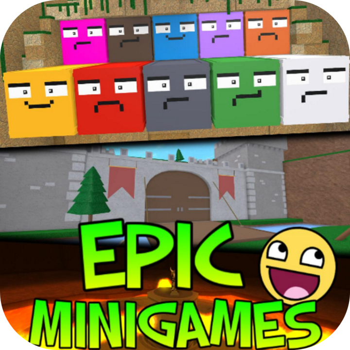

  

    
  

  <!-- <h3>Archive dedicated to Epic Minigames on Roblox</h3> -->

<h2></h2>

<b>This repository is an archive of player-related data for various Roblox games.</b> The primary archive here is about _Epic&nbsp;Minigames_ (a Roblox game released in 2015), hence this repository's name. Intended for historical preservation and educational purposes.

All data in this repository is dynamic, as in it is constantly subject to change over time, particularly because it is focused on player data. For more intrinsic data such as game data and global leaderboards, check out my main repository 'MilkBox'.

<h2>Directory</h2>
Below is a list of quick links to all archives in this project. There's also some archives unrelated to Epic Minigames stored in this repository, because I just want to keep all my archives in one place rather than creating a ton of separate repositories. To see past data for archives, check their commit history.  

| Archive | Game | Format | Description |
| --- | :---: | :---: | --- |
| **[[Epic&nbsp;Minigames] Player&nbsp;Survey](https://github.com/MilkFrame/EpicArchive/tree/main/Archive/Epic%20Minigames/PlayerSurvey)** | <a href="https://www.roblox.com/games/277751860" target="_blank"> | `csv` | Archive of player stats such as levels, wins, and equipped items. |
| **[[Epic&nbsp;Minigames] Countries&nbsp;LB](https://github.com/MilkFrame/EpicArchive/tree/main/Archive/Epic%20Minigames/CountryLeaderboards)** | <a href="https://www.roblox.com/games/277751860" target="_blank"> | `xlsx` `json` | Archive of player level rankings in the country leaderboards. |
| **[[Epic&nbsp;Minigames] Global&nbsp;LB](https://github.com/MilkFrame/MilkBox/blob/main/Leaderboards/Epic%20Minigames%20%5B277751860%5D.lua)** | <a href="https://www.roblox.com/games/277751860" target="_blank"> | `lua` | [_in MilkBox project_] Player level rankings in the global leaderboard. |

| Archive | Game | Format | Description |
| --- | :---: | :---: | --- |
| **[[Better&nbsp;Discovery] Leaderboard](https://github.com/MilkFrame/EpicArchive/blob/main/Archive/Extra/Better%20Discovery/Better%20Discovery%20Rankings.csv)** | <a href="https://www.roblox.com/games/15317947079" target="_blank"> | `csv` | Archive of the top ranked games by their rating. |
| **[[Better&nbsp;Discovery] Metadata](https://github.com/MilkFrame/EpicArchive/tree/main/Archive/Extra/Better%20Discovery)** | <a href="https://www.roblox.com/games/15317947079" target="_blank"> | `lua` | Archive of every game's ratings and metadata. |
| **[[Lockers] Contents](https://github.com/MilkFrame/EpicArchive/tree/main/Archive/Extra/Lockers)** | <a href="https://www.roblox.com/games/6159752615" target="_blank"> | `lua` | Archive of locker owners and locker contents |
| **[[ROBLOX Library] Books](https://github.com/MilkFrame/EpicArchive/blob/main/Archive/Extra/ROBLOX%20Library/ROBLOX%20Library%20Books.csv)** | <a href="https://www.roblox.com/games/331780620" target="_blank"> | `csv` | Archive of books and their metadata |
| **[[Tearose Library] Books](https://github.com/MilkFrame/EpicArchive/tree/main/Archive/Extra/Tearose%20Library)** | <a href="https://www.roblox.com/games/3346338521" target="_blank"> | `csv` | Archive of books and their metadata |

---
